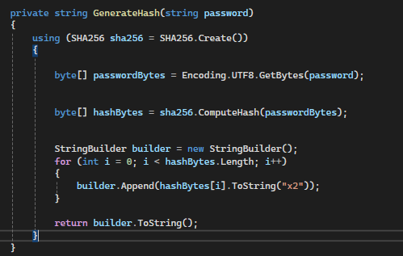
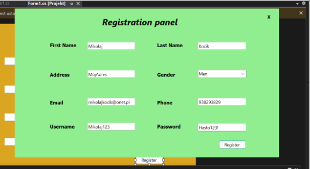

#  Registration Form Validation and Database Integration 

This mini project is a Windows Forms application that validates user inputs, encrypts passwords, and stores data in a PostgreSQL database. It combines robust form validation, secure password management, and intuitive feedback for users.

## ✨ Features
**📝 Form Validation**

- **Required Fields:**  Ensures all fields are completed.

- **Field Validation:**

  - First Name / Last Name: Accepts only letters (supports Polish characters). 
  - Email: Ensures proper format, e.g., user@example.com.
  - Phone Number: Must be exactly 9 digits.
  - Password: Minimum 8 characters, with at least one:
  
    - Uppercase letter.
    - Lowercase letter.
    - Digit.
    - Special character (e.g., @, #, !).
     
  - Gender Selection: Requires selecting a gender.

- **Feedback:**

  - Highlights invalid inputs in red.  
  - Displays clear error messages.
 
## 🔒 Password Encryption

- Uses the SHA256 cryptographic algorithm to securely hash passwords before storage.

- **Advantages:**
  
  - Protects user credentials from unauthorized access.
  - Keeps passwords unreadable, even if the database is breached.
 
## 🗄️ Database Integration

- Connects to a PostgreSQL database using the Npgsql library.
- Inserts user data into a users table:
  
    - **Fields:** First Name, Last Name, Address, Gender, Email, Phone, Username, Password (hashed).
 
## 📊 User Feedback

- **Success:** Displays a success message and sets the background color to green.
- **Failure:** Shows an error message and changes the background to red, prompting corrections.

## 💻 Technologies Used 

- **C#:** Core programming language.
- **Windows Forms:** GUI framework for desktop applications.
- **Npgsql:** PostgreSQL database library.
- **SHA256:** Cryptographic hash algorithm.
- **Regex:** For validating user inputs. 
 
## ✅ Input Validation Examples 

**✉️ Email Validation:**

## 🔑 Password Requirements:

- Minimum 8 characters.
- At least:
  
  - 1 uppercase letter (e.g., A).
  - 1 lowercase letter (e.g., a).
  - 1 digit (e.g., 1).
  - 1 special character (e.g., @, #).
 
## Database Setup 🛠️    

-  Create a PostgreSQL database:

          CREATE DATABASE projektCsharp;

-  Create 'users' table:

         CREATE TABLE users (
          id SERIAL PRIMARY KEY,
          first_name VARCHAR(50),
          last_name VARCHAR(50),
          address TEXT,
          gender VARCHAR(10),
          email VARCHAR(100),
          phone VARCHAR(15),
          username VARCHAR(50),
          password TEXT
         );
- Configure the connection string in the code:

       Server=localhost;Port=5432;Username=postgres;Password=Password;Database=ProjektCsharp

## 🔐 How Password Encryption Works 

- Converts the plaintext password to bytes.
- Uses the SHA256 algorithm to generate a cryptographic hash.
- Stores the hash in the database.
  
**🔑 Example Hashing Function:**

## 🖼️ Application Screenshot 

## 📜License 

This project is licensed under the MIT License.

